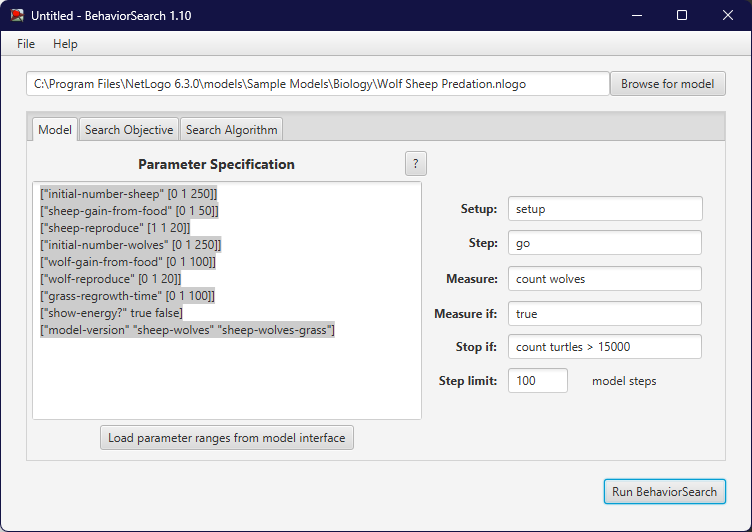
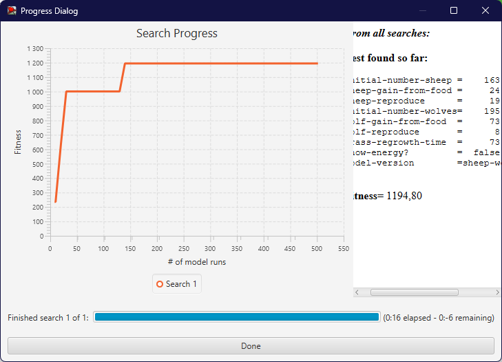

## Комп'ютерні системи імітаційного моделювання

## СПм-23-4, Дубихвіст Вадим Вячеславович

### Лабораторна робота №**3**. Використання засобів обчислювального интелекту для оптимізації імітаційних моделей

 

### Варіант 7, модель у середовищі NetLogo:

[Wolf Sheep Predation](https://www.netlogoweb.org/launch#http://www.netlogoweb.org/assets/modelslib/Sample%20Models/Biology/Wolf%20Sheep%20Predation.nlogo)

 

## Вербальний опис моделі:

Ця модель досліджує стабільність екосистем хижак-жертва. Така система вважається нестабільною, якщо вона має схильність до вимирання одного або кількох видів. З іншого боку, система є стабільною, якщо вона здатна підтримувати свій баланс протягом тривалого часу, незважаючи на коливання чисельності популяцій.

### Існує два основних варіанти цієї моделі:

1. **Версія «вівці-вовки»:**
   Вовки та вівці безладно переміщуються по ландшафту. Вовки шукають овець, щоб їх з’їсти. Кожен крок для вовка вимагає енергії, тому їм потрібно полювати на овець для відновлення енергії. Якщо енергія закінчується, вовк помирає. Для збереження популяції кожен вовк і кожна вівця мають фіксовану ймовірність розмноження на кожному кроці часу. Трава в цій версії моделі змодельована як «нескінченна», тому вівці завжди мають достатньо їжі. Вівці не отримують або не втрачають енергію під час їжі чи руху. Ця варіація створює цікаву динаміку популяцій, але зрештою модель виявляється нестабільною. Вона добре підходить для моделювання взаємодій між видами в середовищі з багатими ресурсами, наприклад, двох штамів бактерій у чашці Петрі.

2. **Версія «вівці-вовки-трава»:**
   У цій версії до вовків і овець додається трава. Поведінка вовків аналогічна першому варіанту, але тепер вівці повинні їсти траву для підтримки своєї енергії. Коли трава закінчується, вона відростає через певний проміжок часу. Ця варіація є складнішою, але загалом стабільною. Вона ближча до класичних моделей коливань популяцій Лотки-Вольтерра. Хоча класичні моделі Лотки-Вольтерра припускають, що популяції можуть мати реальні значення, вони виявляються неточними для малих популяцій, тоді як агентні моделі, як ця, дають більш реалістичні результати.

### Керуючі параметри:

- **model-version** - вибір версії моделі.
- **initial-number-sheep** - початкова кількість овець.
- **initial-number-wolves** - початкова кількість вовків.
- **grass-regrowth-time** - скільки часу потрібно, щоб трава відростала після того, як її з’їли.
- **sheep-gain-from-food** - Кількість енергії, яку вівці отримують за кожну з’їдену травинку.
- **wolf-gain-from-food** - кількість енергії, яку вовки отримують за кожну з’їдену вівцю.
- **sheep-reproduce** - ймовірність вівця розмножується на кожному кроці часу.
- **wolf-reproduce** - ймовірність розмноження вовка на кожному кроці часу.

### Параметри візуалізації:

- **show-energy** - показувати чи ні енергію кожної тварини як число?

### Показники роботи системи:

- **sheep** - поточна кількість овець.
- **wolves** - поточна кількість вовків.
- **grass** - поточна кількість трави.
- **populations** - графік, що відображує значення параметрів **sheep**, **wolves** та **grass**.

 

### Налаштування середовища BehaviorSearch:

**Обрана модель**:

<pre>
C:\Program Files\NetLogo 6.3.0\models\Sample Models\Biology\Wolf Sheep Predation.nlogo
</pre>

**Параметри моделі** (вкладка Model):  
_Параметри та їх модливі діапазони були **автоматично** вилучені середовищем BehaviorSearch із вибраної імітаційної моделі, для цього є кнопка «Завантажити діапазони параметрів із інтерфейсу моделі»_:

<pre>
["initial-number-sheep" [0 1 250]]
["sheep-gain-from-food" [0 1 50]]
["sheep-reproduce" [1 1 20]]
["initial-number-wolves" [0 1 250]]
["wolf-gain-from-food" [0 1 100]]
["wolf-reproduce" [0 1 20]]
["grass-regrowth-time" [0 1 100]]
["show-energy?" true false]
["model-version" "sheep-wolves" "sheep-wolves-grass"]
</pre>

Використовувана **міра**:  
Для фітнес-функції було обрано **значення кількості вовків** та вказано у параметрі "**Measure**":

<pre>
count wolves
</pre>

Загальний вигляд вкладки налаштувань параметрів моделі:

**Налаштування цільової функції** (вкладка Search Objective):  
Метою підбору параметрів імітаційної моделі, є **максимізація** значення кількості вівець на полі – це вказано через параметр "**Goal**" зі значенням **Maximize Fitness**. Тобто необхідно визначити такі параметри налаштувань моделі, у яких виживає максимальні кількість вовків.
Загальний вигляд вкладки налаштувань цільової функції:

**Налаштування алгоритму пошуку** (вкладка Search Algorithm):  
Загальний вид вкладки налаштувань алгоритму пошуку:

 

### Результати використання BehaviorSearch:

Діалогове вікно виглядало настпуним чином:

Результат пошуку параметрів імітаційної моделі, використовуючи **генетичний алгоритм**:

Результат пошуку параметрів імітаційної моделі, використовуючи **випадковий пошук**:

 
